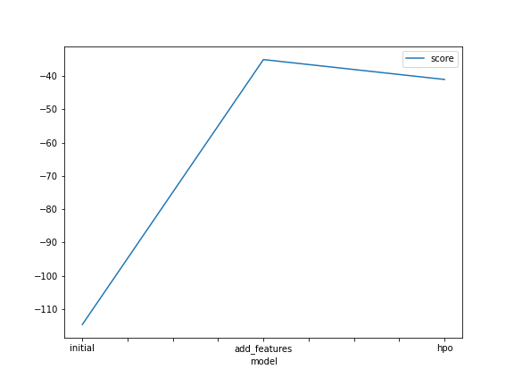
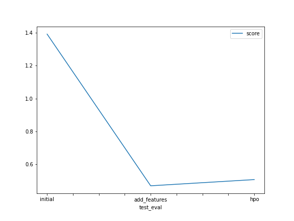

# Report: Predict Bike Sharing Demand with AutoGluon Solution
#### Fady Morris Ebeid

## Initial Training
### What did you realize when you tried to submit your predictions? What changes were needed to the output of the predictor to submit your results?
When I tried to submit my predictions, ......................................................................be corrected.

### Create a table with the models you ran, the hyperparameters modified, and the kaggle score.
|model|NN|GBM|RF|score|
|--|--|--|--|--|
|initial|default|default|default|1.39067|
|add_features|default|default|default|0.47037|
|hpo|NN Tuning|RF Tuning|GBM Tuning|0.50799|

### Create a line plot showing the top model score for the three (or more) training runs during the project.

### Create a line plot showing the top kaggle score for the three (or more) prediction submissions during the project.

