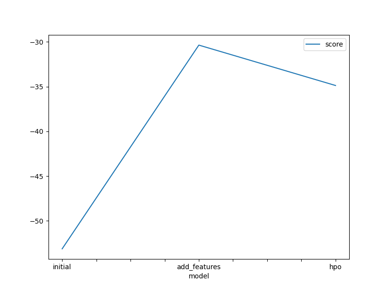
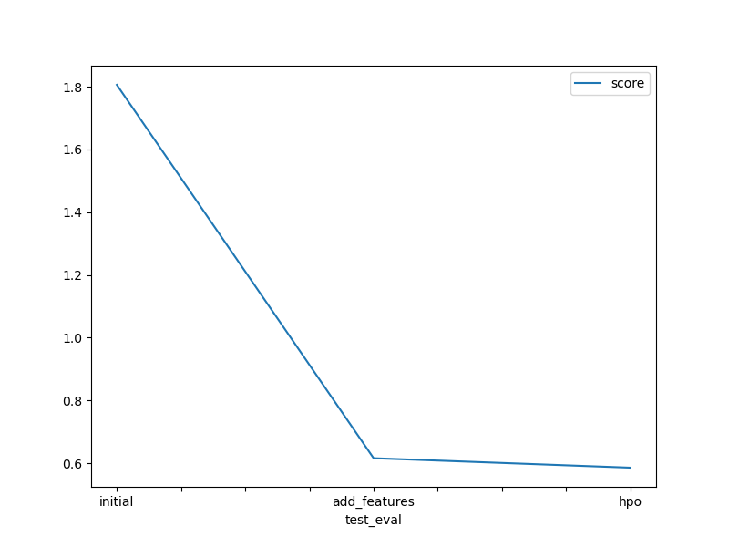

# Report: Predict Bike Sharing Demand with AutoGluon Solution
#### ABUBAKAR ABUBAKAR AL-AMIN

## Initial Training
### What did you realize when you tried to submit your predictions? What changes were needed to the output of the predictor to submit your results?
I my predictions no were needed because all of my predictions were > 0

### What was the top ranked model that performed?
The top ranked model was  WeightedEnsemble_L3 with score_val of -53.126572 and pred_time_val, fit_time, pred_time_val_marginal, fit_time_ of  21.491584, 368.646480, 0.000702 and 0.065879 respectively

## Exploratory data analysis and feature creation
### What did the exploratory analysis find and how did you add additional features?
I my exploratory data analysis created a histogram of all features to show the distribution of each one relative to the data.
I added new features by seprating the "datetime" column in year, month, day and hour

### How much better did your model preform after adding additional features and why do you think that is?
The model score_val ,pred_time_val, fit_time, pred_time_val_marginal, fit_time_ became -30.353867, 25.945842, 361.508742, 0.000889, 0.036304 respectively.

## Hyper parameter tuning
### How much better did your model preform after trying different hyper parameters?
The model score_val , pred_time_val, fit_time, pred_time_val_marginal, fit_time_ became -34.869666, 6.391285,  118.907295, 0.000630, 0.030676

### If you were given more time with this dataset, where do you think you would spend more time?
I will spend more on the hyper parameter tuning
### Create a table with the models you ran, the hyperparameters modified, and the kaggle score.
|model|hpo1|hpo2|hpo3|score|
|initial | prescribed_values | prescribed_values | "presets: 'high quality' (auto_stack=True)" | 1.80616 |
|add_features|prescribed_values | prescribed_values | "presets: 'high quality' (auto_stack=True)" | 0.61570 |
|hpo | Tree-Based Models(CAT, RF, XT & KNN) | KNN | "presets: 'optimize_for_deployment" | 0.58551 |

### Create a line plot showing the top model score for the three (or more) training runs during the project.

### Create a line plot showing the top kaggle score for the three (or more) prediction submissions during the project.

## Summary

* The AutoGluon AutoML framework for Tabular Data was thoroughly studied and incorporated into the bike sharing demand prediction project. It was observed that the top-ranked model was WeightedEnsemble_L3 with a score_val of -53.126572 and pred_time_val, fit_time, pred_time_val_marginal, fit_time_ of 21.491584, 368.646480, 0.000702, and 0.065879 respectively. 

* During the exploratory data analysis (EDA), a histogram of all features was created to show the distribution of each one relative to the data. Additionally, new features were added by separating the "datetime" column into year, month, day, and hour. This led to an improvement in the model's performance, with the score_val, pred_time_val, fit_time, pred_time_val_marginal, and fit_time_ becoming -30.353867, 25.945842, 361.508742, 0.000889, and 0.036304 respectively.

* Hyperparameter tuning using AutoGluon was also explored, resulting in a further improvement in performance. The model's score_val, pred_time_val, fit_time, pred_time_val_marginal, and fit_time_ became -34.869666, 6.391285, 118.907295, 0.000630, and 0.030676 respectively.

* It was noted that hyperparameter tuning using AutoGluon (without default hyperparameters or random configuration of parameters) can be a  heavy process, highly dependent on the time limit, prescribed presets, possible family of models, and range of hyperparameters to be tuned. If given more time with the dataset, further focus would be put on hyperparameter tuning to potentially enhance the model's performance.
